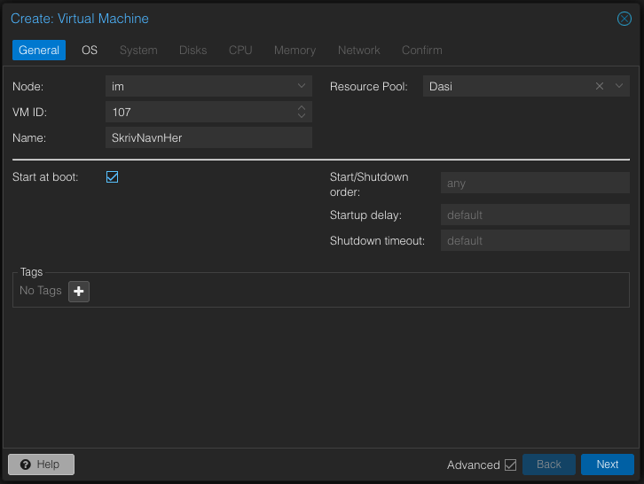
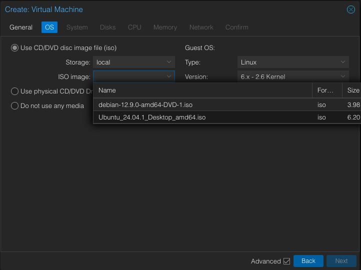
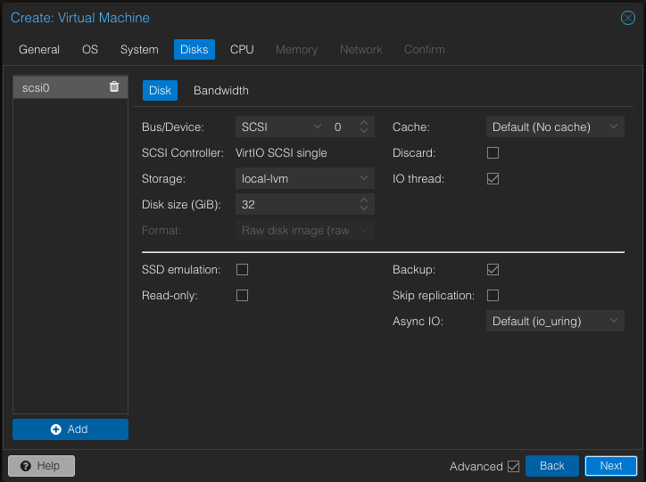
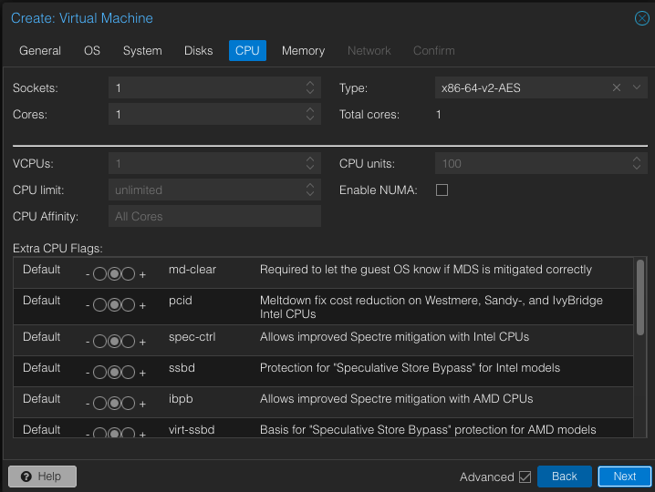
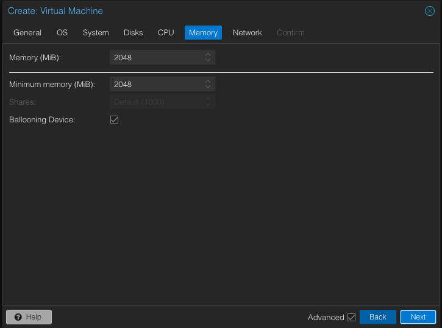
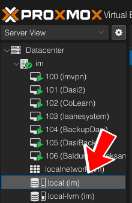
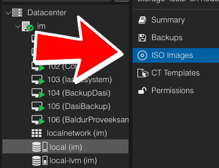
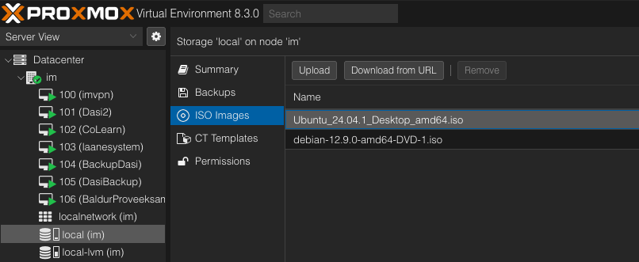

# IM Serveren

# Innholdsfortegnelse

-   [Om oss som satt opp serveren](#om-oss-som-satt-opp-serveren)
-   [Hvordan serveren er satt opp](#hvordan-serveren-er-satt-opp)
-   [Hvordan koble seg på Proxmox](#hvordan-koble-seg-på-proxmox)
-   [Hvordan sette opp VM](#hvordan-sette-opp-vm)
-   [FAQ](#faq)

# Om oss som satt opp serveren

IM Serveren er satt opp av:

| Navn                | GitHub 🤖                                       | LinkedIn 💼                                                | E-post 📧                                               |
| ------------------- | ----------------------------------------------- | ---------------------------------------------------------- | ------------------------------------------------------- |
| Daniel Johan Sørby  | [DanielJSorby](https://github.com/danieljsorby) | [LinkedIn](https://www.linkedin.com/in/danieljsorby)       | [kontakt@danielsorby.no](mailto:kontakt@danielsorby.no) |
| Simen Evenrud Blien | [SimenBlien](https://github.com/simenblien)     | [LinkedIn](https://www.linkedin.com/in/simenevenrudblien/) | [simeneblien@icloud.com](mailto:simeneblien@icloud.com) |

# Hvordan serveren er satt opp

Serveren er satt opp ved bruk av [Proxmox](https://www.proxmox.com/en/). Dette er det som gir oss muligheten til å sette opp Virituelle Maskiner på IM Serveren.

# Hvordan koble seg på Proxmox

For å koble seg til proxmox, må du først komme deg på samme nett som serveren. Da må du enten koble deg via wifi til BakkAdmin2, eller koble deg til via ethernett til veggen. Hvis du har noen problemer, sjekk [Hvordan vet jeg at ethernett inngangen i veggen fungerer](#hvordan-vet-jeg-at-ethernett-inngangen-i-veggen-fungerer).
<br>
Deretter går du på [172.31.0.18:8006](https://172.31.0.18:8006/) og logger inn på brukeren du har fått. [Har du ikke bruker?](#jeg-har-ikke-bruker-hva-skal-jeg-gjøre) Hvis du får opp at siden ikke er sikker, trykker du på avansert, og gå inn likevell. Får du opp en melding som sier vi ikke har abbonnement eller lignende, bare trykk OK.
<br> Når du er inne på proxmox da, vil det se ca slik ut:


# Hvordan sette opp VM

For å sette opp en VM, må du [gå inn på proxmox](#hvordan-koble-seg-på-proxmox), og [laste opp et ISO bilde](#hvordan-laster-jeg-opp-et-iso-bilde), før du trykker på den blå knappen øverst i høyre hjørne, hvor det står "Create VM" <br>Da vil det åpne en meny som ser slik ut:<br><br>Her lar du Node forbli på im. VM ID, lar du være den det er. Navn skriver du navnet på VM din. Resource pool velger du gruppen som er satt opp for deg og ditt prosjekt. Du velger selv om du vil ha på Start at boot.<br>
Så skal du velge hvilket operativsystem du skal bruke<br><br>
Her velger du hvilket ISO bilde du skal ha. [Har du ikke lastet opp ISO bilde?](#hvordan-laster-jeg-opp-et-iso-bilde)<br>Den neste siden kan du bare hoppe over.<br>På neste side velger du hvor mye lagringsplass din VM skal ha:<br><br>
Her velger du inder Disk size hvor mye lagring du trenger i GB. Vet du ikke hvor mye du trenger, kan du enten bare la den være, eller spørre noen.<br>
På neste side velger du CPU instillingene du trenger:<br><br>Her er det det samme som sist. Velg det du trenger, og vet du ikke, spør du noen.<br>
På denne siden skal du velge hvor mye minne du trenger (RAM)<br><br>Her velger du også selv hvor mye minne du trenger. Vet du ikke ville jeg anbefalt 8GB eller 16GB avhengig av hvor intense oppgaver du skal gjøre. Dette gjør du ved å endre på der hvor det står Memory (MiB)<br>Den neste siden kan du bare hoppe over, også trykker du Finish.<br>
Gratulerer! Da har du satt opp din VM

# FAQ

-   ## Innholdsfortegnelse

    -   [Hvordan vet jeg at ethernett inngangen i veggen fungerer](#hvordan-vet-jeg-at-ethernett-inngangen-i-veggen-fungerer)
    -   [Jeg har ikke en bruker, hva skal jeg gjøre?](#jeg-har-ikke-bruker-hva-skal-jeg-gjøre)
    -   [Hva skal jeg gjøre hvis serverrommet er låst?](#hva-skal-jeg-gjøre-hvis-serverrommet-er-låst)
    -   [Hvordan laster jeg opp et ISO bilde?](#hvordan-laster-jeg-opp-et-iso-bilde)

-   ## Hvordan vet jeg at ethernett inngangen i veggen fungerer?

    Først, [skru av wifi](https://support.apple.com/no-no/guide/mac-help/mh11935/mac), og sjekk om du kan gå inn på en nettside. Du kan prøve denne for eksempel [dasigpt.com](https://dasigpt.com/). Hvis dette ikke funker, åpne terminalen og skriv dette:
    `ping vg.no` (dette kan være hvilken som helst nettside eller ip som du vet du pleier å få en respons fra), og sjekk om du får en respons som ligner på dette:

    ```bash
    PING vg.no (195.88.54.16): 56 data bytes
    64 bytes from 195.88.54.16: icmp_seq=0 ttl=242 time=8.975 ms
    64 bytes from 195.88.54.16: icmp_seq=1 ttl=242 time=8.846 ms
    64 bytes from 195.88.54.16: icmp_seq=2 ttl=242 time=20.550 ms
    64 bytes from 195.88.54.16: icmp_seq=3 ttl=241 time=10.495 ms
    ```

    Hvis du får en respons som ser slik ut:<br>
    `Request timeout for icmp_seq 1` eller `Could not resolve host`, så må du først sjekke der hvor du er plugget inn, og huske tallet som står <br>
    Så går du inn på serverrommet i grønn base. [Er det låst?](#hva-skal-jeg-gjøre-hvis-serverrommet-er-låst) Når du er inne i serverrommet går du hit  og passer på at det er koblet en ethernett kabel fra ruter swithcen til tallet ditt 

    ## Jeg har ikke bruker, hva skal jeg gjøre?

    Hvis du ikke har bruker, kan du enten da kontakt med [vi som satt opp serveren](#om-oss-som-satt-opp-serveren), eller ta kontakt med en IT Lærer.

    ## Hva skal jeg gjøre hvis serverrommet er låst?

    Hvis serverrommet er låst, tar du kontakt med en IT lærer, eller bruker hammeren som har nøkkel. Husk at du kan ikke gå inn på serverrommet uten tillatelse

    ## Hvordan laster jeg opp et ISO bilde

    For å laste opp et ISO bilde på proxmox må du først velge local (im) <br><br> Så velger du ISO images<br><br>Og til slutt velger du hvordan du ønsker å laste opp. Du kan legge ved en URL, eller laste opp fra enheten din <br>
